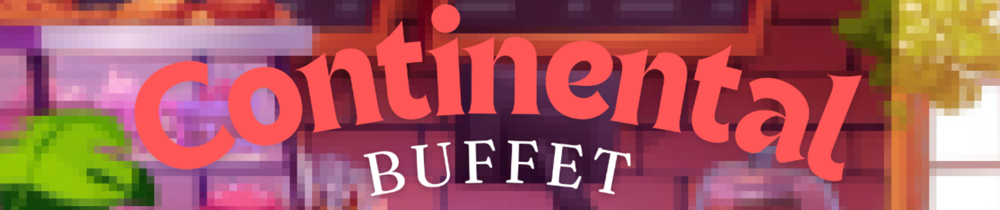
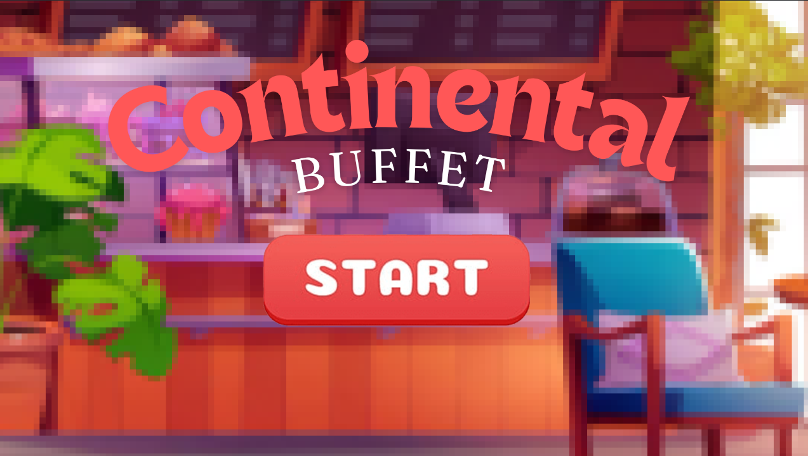
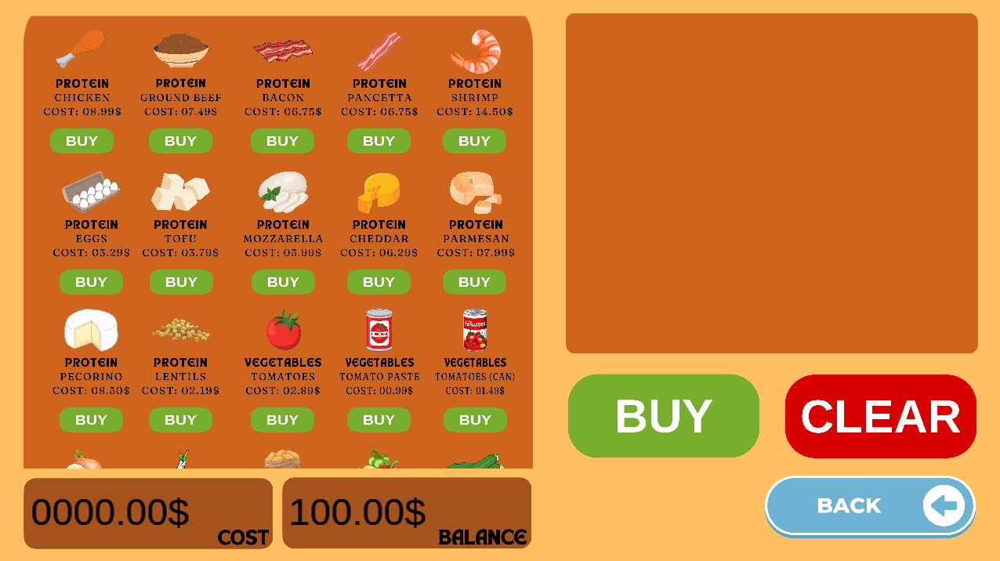
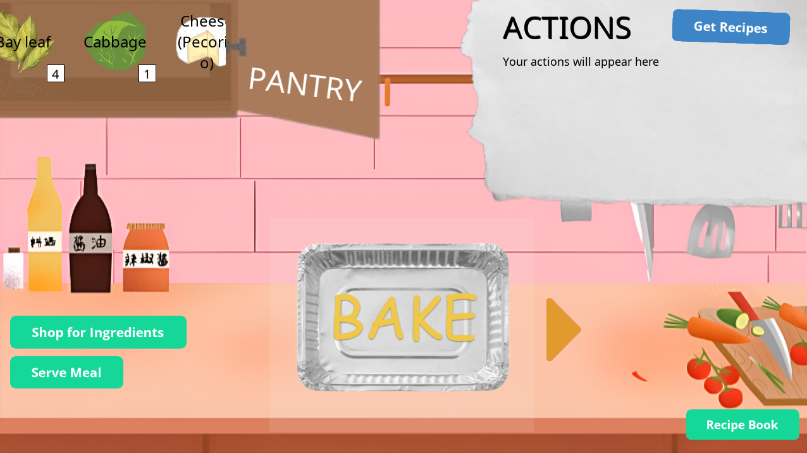
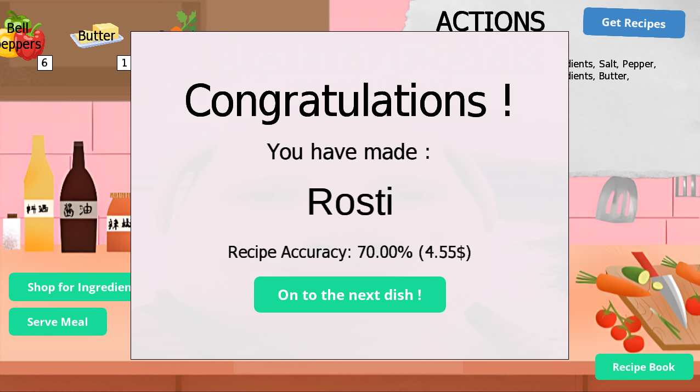
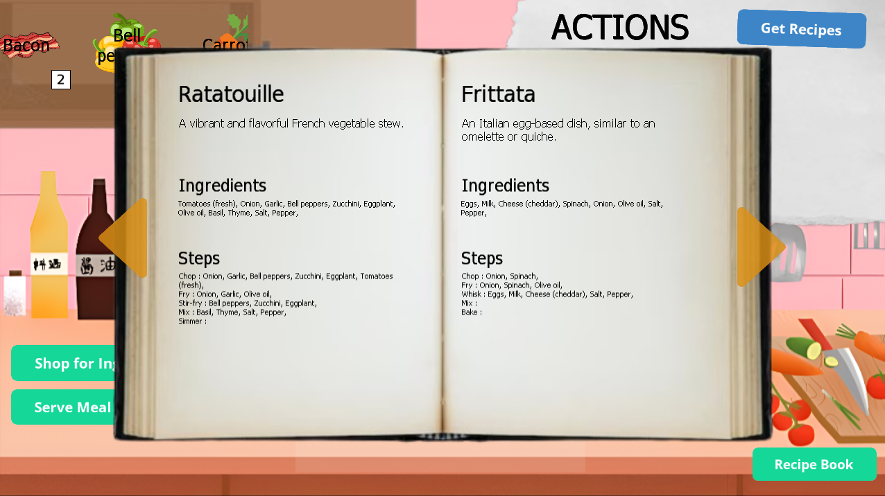
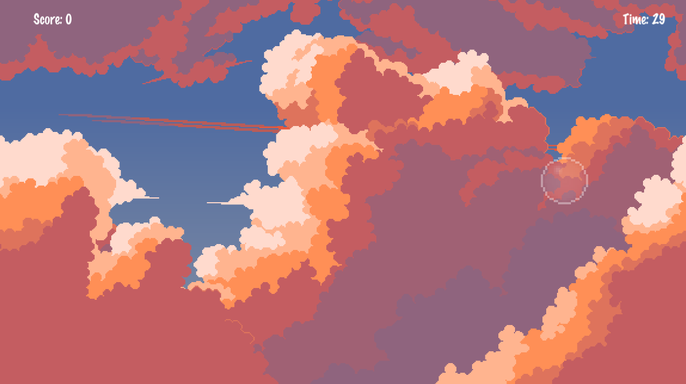

  

<!-- 

  

 -->

      

---

## About the Game  
In **ContinentalBuffet**, you can:  
- 🥘 **Cook recipes** from all around the world  
- 🛒 **Buy ingredients** from the in-game store  
- 💰 **Earn money** by playing the **bubble-popping minigame** and **cooking meals** 
- 📖 **Unlock new recipes** by reaching high scores in the minigame  

---

## 🎮 Gameplay Loop  
1. Pop bubbles in the mini-game to earn coins  
2. Use your coins to buy ingredients  
3. Cook international recipes  
4. Unlock new recipes by achieving a high enough score in the bubble minigame

---

## 📸 Screenshots  

### Main Menu  
  

### Store  
  

### Cooking View  
  
  
  

### Bubble Popping Minigame  
  

---

## 🛠️ Installation  

### Play the Game  
1. Head to the [Releases](https://github.com/karlosian/ContinentalBuffet/releases) page  
2. Download the latest build for your platform  
3. Extract and run the executable  

### Developer Setup (via Axmol DevSetup)  
If you’d like to build or contribute, follow Axmol’s official developer setup guide  
You can review the guide here: [Axmol DevSetup](https://github.com/axmolengine/axmol/blob/dev/docs/DevSetup.md)  

---

## 🚀 Features Coming Soon  
- 🤔 TBD
  
---
## 🤝 Contributing  
Contributions are welcome!  
- Fork the repo  
- Create a feature branch  
- Submit a pull request  

---

## 📜 License  
This project is licensed under the [MIT License](LICENSE).  
Built with the [Axmol Engine](https://github.com/axmolengine/axmol), licensed under the MIT License.
See `LICENSES/AXMOL_LICENSE` for details.
